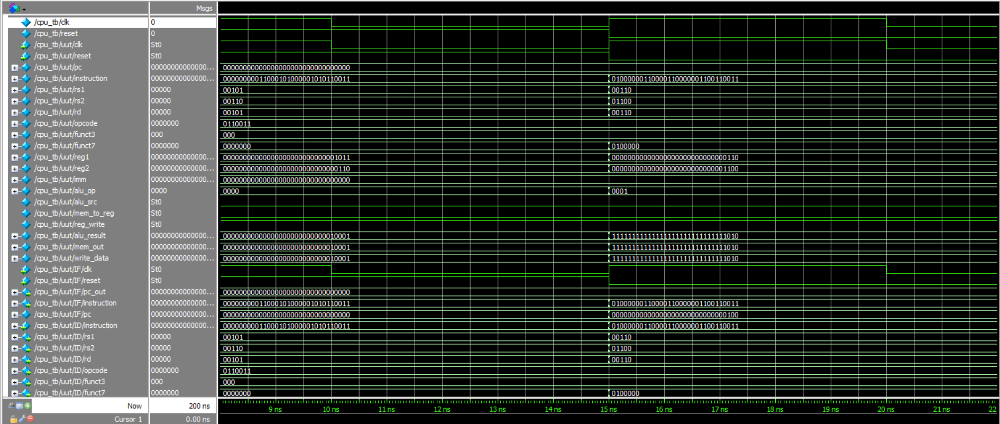
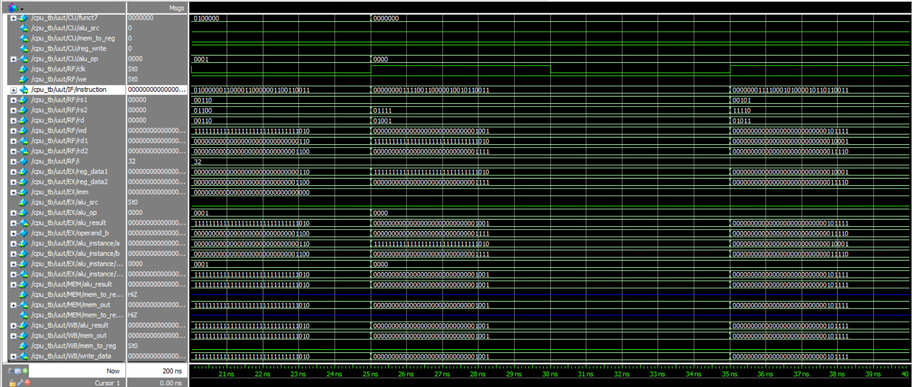
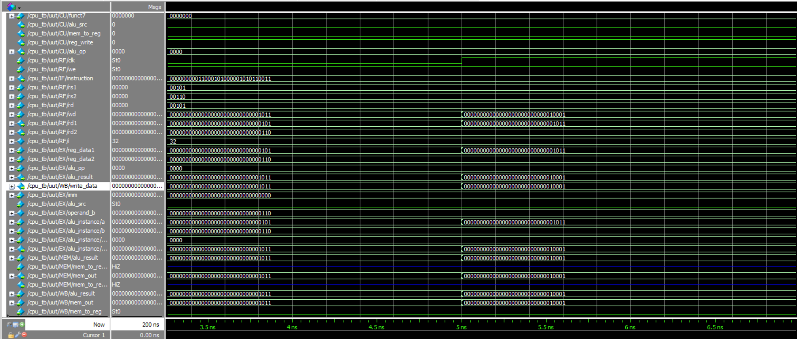

# Code Pro – Modular RISC-V CPU (5-Stage Skeleton)

This project implements a modular RISC-V CPU (RV32I subset) structured with 5 clearly separated stages, simulating a pipeline-ready architecture. Each stage is tested and simulated using ModelSim.

## Features

- Modular Verilog design with:
  - IF (Instruction Fetch)
  - ID (Instruction Decode)
  - EX (Execute)
  - MEM (Memory)
  - WB (Write Back)
- Supports R-type and I-type instructions (e.g., ADD, SUB, ADDI)
- Easy to extend to pipelined version
- Testbench included with sample program

## Folder Structure

Code_Pro_RISC-V/
├── src/ # All Verilog source files
├── testbench/ # Testbench and test program
├── waveforms/ # ModelSim simulation screenshots

├── README.md
└── .gitignore

## Simulation

All stages were tested using ModelSim. Below are key simulation results.

### Screenshot 1 – Instruction Fetch & Decode  

### Screenshot 2 – Register Read & ALU Operation  

### Screenshot 3 – Writeback to Register File  

## Learnings

- Designed and simulated a modular CPU from scratch
- Understood RISC-V ISA decoding, ALU control, and instruction execution
- Practiced debugging and waveform analysis using ModelSim

## Future Work

- Implement full pipelining with IF/ID, ID/EX, EX/MEM, MEM/WB buffers
- Add support for branching and memory instructions
- Integrate hazard detection and forwarding

## Credits

Project by **[Benedict Jowin C](https://www.linkedin.com/in/benedict-jowin/)**  
IIT Tirupati | Electrical Engineering | Class of 2027
